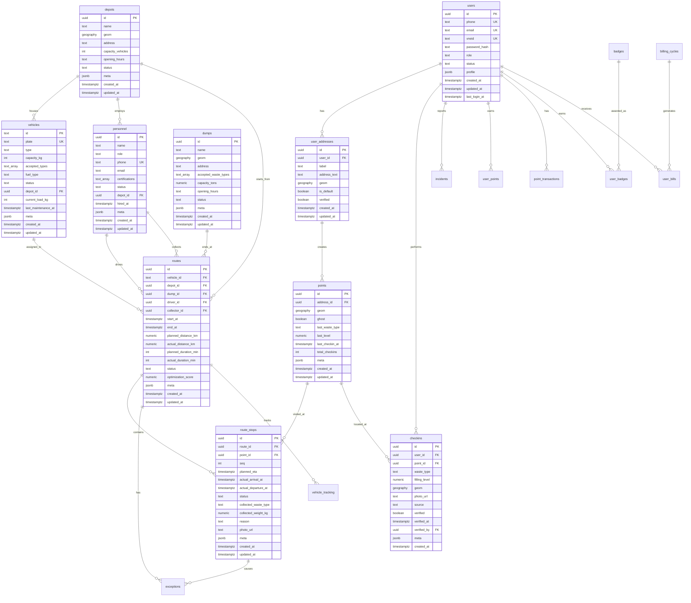

# EcoCheck Database Entity Relationship Diagram

## Core Relationships



## Gamification & Billing

```mermaid
erDiagram
    users ||--o{ user_points : "has"
    users ||--o{ point_transactions : "performs"
    users ||--o{ user_badges : "earns"
    badges ||--o{ user_badges : "awarded_as"
    billing_cycles ||--o{ user_bills : "generates"
    users ||--o{ user_bills : "receives"
    
    user_points {
        uuid id PK
        uuid user_id FK_UK
        int points
        int level
        int total_checkins
        int total_recyclable
        int total_bulky
        int streak_days
        date last_checkin_date
        jsonb meta
        timestamptz created_at
        timestamptz updated_at
    }
    
    point_transactions {
        uuid id PK
        uuid user_id FK
        int points
        text type
        text reason
        uuid reference_id
        text reference_type
        jsonb meta
        timestamptz created_at
    }
    
    badges {
        uuid id PK
        text code UK
        text name
        text description
        text icon_url
        jsonb criteria
        int points_reward
        text rarity
        boolean active
        timestamptz created_at
    }
    
    user_badges {
        uuid id PK
        uuid user_id FK
        uuid badge_id FK
        timestamptz earned_at
    }
    
    billing_cycles {
        uuid id PK
        text name
        date start_date
        date end_date
        text status
        timestamptz created_at
    }
    
    user_bills {
        uuid id PK
        uuid user_id FK
        uuid billing_cycle_id FK
        int total_checkins
        numeric total_weight_estimated_kg
        numeric base_fee
        numeric variable_fee
        numeric discount
        numeric total_amount
        text status
        date due_date
        timestamptz paid_at
        text payment_method
        jsonb meta
        timestamptz created_at
        timestamptz updated_at
    }
```

## Legend

- **PK**: Primary Key
- **FK**: Foreign Key
- **UK**: Unique Key
- **||--o{**: One-to-Many relationship
- **geography**: PostGIS geography(Point,4326) type
- **jsonb**: JSON binary type for flexible metadata
- **text_array**: PostgreSQL text array type

